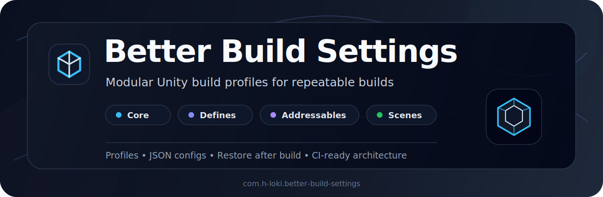

<p align="center">
  
</p>

Better Build Settings is a modular Unity build configuration tool for repeatable builds inside the Unity Editor and CI/CD pipelines.

Better Build Settings lets you describe a build configuration explicitly instead of repeatedly changing scenes, scripting define symbols, Addressables profiles, and other project settings by hand.

The package is intended for projects that need multiple reproducible build variants, such as:

- Development and production builds
- Client-specific builds
- Demo and full-game configurations
- Builds with different scene sets
- Builds with different scripting define symbols
- Builds using different Addressables profiles


[!WARNING]
Better Build Settings is currently an experimental prototype under active development.

The API, configuration format, package structure, and module lifecycle may change between versions. Do not introduce it into a critical release pipeline without reviewing the source code, testing recovery behavior, and pinning the package to a specific commit or release.

## Why Better Build Settings?

Unity build configuration is commonly distributed across several unrelated systems:

- Build Settings
- PlayerSettings
- Scripting define symbols
- Addressables settings
- Custom build scripts
- Environment-specific editor state

This works until a project has more than one build variant.

At that point, build preparation often becomes a sequence of undocumented manual steps or a large project-specific script with implicit state and fragile cleanup logic.

Better Build Settings approaches the problem differently:

1. A build is described by a profile.
2. Each concern is handled by an independent module.
3. Modules apply their configuration before the build. 
4. Previous project state is restored after the build attempt.

**The goal** is to make build configuration explicit, reviewable, extensible, and eventually suitable for automation.

##  Project status

Current maturity: experimental / prototype

The project is usable for evaluation, internal tooling, and controlled development environments. It should not yet be treated as a drop-in production build system.

Current limitations may include:

- Limited build-target support
- Incomplete command-line and batch-mode workflows
- No guarantee of recovery after an editor crash or forced process termination
- Potential breaking changes in configuration schemas
- Limited automated test coverage
- Limited validation across Unity and Addressables versions
- Incomplete documentation for custom module development

The repository is being developed in public so that its architecture and failure modes can be reviewed early.

## Packages

Better Build Settings is split into separate Unity packages.

| Package | Purpose | Documentation |
|---|---|---|
| `com.h-loki.better-build-settings` | Core package. Provides profiles, build window, module API, and build flow. | [Read more](./BetterBuildSettings/com.h-loki.better-build-settings/README.md) |
| `com.h-loki.better-build-settings.defines` | Defines module. Controls scripting define symbols. | [Read more](./BetterBuildSettings/com.h-loki.better-build-settings.defines/README.md) |
| `com.h-loki.better-build-settings.addressables` | Addressables module. Controls Addressables groups included in a build. | [Read more](./BetterBuildSettings/com.h-loki.better-build-settings.addressables/README.md) |
| `com.h-loki.better-build-settings.scenes` | Scenes module. Controls scenes included in build settings. | [Read more](./BetterBuildSettings/com.h-loki.better-build-settings.scenes/README.md) |


Install the core package first. Then install only the modules you need.

## Installation

Open Unity Package Manager:

```text
Window / Package Manager
```
Install Core first:
```
https://github.com/h-loki/BetterBuildSettings.git?path=/BetterBuildSettings/com.h-loki.better-build-settings
```
Install Defines module:
```
https://github.com/h-loki/BetterBuildSettings.git?path=/BetterBuildSettings/com.h-loki.better-build-settings.defines
```
Install Addressables module:
```
https://github.com/h-loki/BetterBuildSettings.git?path=/BetterBuildSettings/com.h-loki.better-build-settings.addressables
```
Install Scenes module:

Install this package if you need scene list control for build profiles:

```text
https://github.com/h-loki/BetterBuildSettings.git?path=/BetterBuildSettings/com.h-loki.better-build-settings.scenes
```

Or add packages to Packages/manifest.json:
```
{
  "dependencies": {
    "com.h-loki.better-build-settings": "https://github.com/h-loki/BetterBuildSettings.git?path=/BetterBuildSettings/com.h-loki.better-build-settings",
    "com.h-loki.better-build-settings.defines": "https://github.com/h-loki/BetterBuildSettings.git?path=/BetterBuildSettings/com.h-loki.better-build-settings.defines",
    "com.h-loki.better-build-settings.addressables": "https://github.com/h-loki/BetterBuildSettings.git?path=/BetterBuildSettings/com.h-loki.better-build-settings.addressables"
  }
}
```
### Requirements

Core:

- Unity 2021.3+
- Odin Inspector
- Newtonsoft Json

Defines module:

- Better Build Settings Core

Addressables module:

- Better Build Settings Core
- Unity Addressables

### Usage

Open the window:
```
Tools / Build Settings
```
Create or select a build profile.

Enable required modules.

Configure module settings.

Press:

<p align="left">
  
</p>


### Build Profiles

A profile stores enabled modules and their settings.

Examples:
```
default
android_dev
android_prod
steam_demo
```
Profiles are stored as JSON.

Example:
```json
{
  "Modules": [
    {
      "ModuleId": "addressables",
      "Enabled": true,
      "JsonPayload": {
        "restoreAfterBuild": true,
        "enabledGroups": [
          "Gameplay",
          "UI"
        ]
      }
    }
  ]
}
```
### Modules
#### Defines

Controls scripting define symbols.

Example config:
```json
{
  "restoreAfterBuild": true,
  "enabledDefines": [
    "PRODUCTION",
    "STEAM_BUILD"
  ]
}
```
#### Addressables

Controls which Addressables groups are included in the build.

Example config:
```json
{
  "restoreAfterBuild": true,
  "enabledGroups": [
    "Base",
    "Gameplay",
    "UI"
  ]
}
```

### Build Flow

When BUILD is pressed:

1. Current profile is saved.
2. Enabled modules apply temporary project changes.
3. Unity BuildPipeline.BuildPlayer runs.
4. Modules restore the previous project state.
Restore runs even if the build fails.

### Current Limitations
- Targets StandaloneWindows64.
- Uses local JSON configuration.
- No CLI entry point yet.
- No profile inheritance yet.
- License
