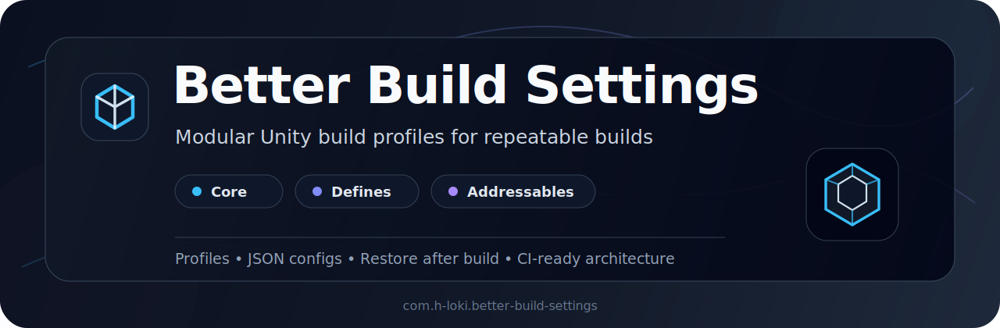

<p align="center">
  
</p>

Better Build Settings is a modular Unity build configuration tool for repeatable builds inside the Unity Editor and CI/CD pipelines.

The tool provides:

- build profiles;
- modular build pipeline customization;
- Addressables group control;
- scripting define symbol control;
- automatic restore of project state after build;
- JSON-based configuration storage.

## Packages

Better Build Settings is split into separate Unity packages.

| Package | Purpose |
|---|---|
| `com.h-loki.better-build-settings` | Core package. Provides profiles, build window, module API and build flow. |
| `com.h-loki.better-build-settings.defines` | Defines module. Controls scripting define symbols. |
| `com.h-loki.better-build-settings.addressables` | Addressables module. Controls Addressables groups included in build. |

Install the core package first. Then install only the modules you need.

## Installation

Open Unity Package Manager:

```text
Window / Package Manager
```
Install Core first:
```
https://github.com/h-loki/BetterBuildSettings.git?path=/BetterBuildSettings/com.h-loki.better-build-settings
```
Install Defines module:
```
https://github.com/h-loki/BetterBuildSettings.git?path=/BetterBuildSettings/com.h-loki.better-build-settings.defines
```
Install Addressables module:
```
https://github.com/h-loki/BetterBuildSettings.git?path=/BetterBuildSettings/com.h-loki.better-build-settings.addressables
```
Or add packages to Packages/manifest.json:
```
{
  "dependencies": {
    "com.h-loki.better-build-settings": "https://github.com/h-loki/BetterBuildSettings.git?path=/BetterBuildSettings/com.h-loki.better-build-settings",
    "com.h-loki.better-build-settings.defines": "https://github.com/h-loki/BetterBuildSettings.git?path=/BetterBuildSettings/com.h-loki.better-build-settings.defines",
    "com.h-loki.better-build-settings.addressables": "https://github.com/h-loki/BetterBuildSettings.git?path=/BetterBuildSettings/com.h-loki.better-build-settings.addressables"
  }
}
```
### Requirements

Core:

- Unity 2021.3+
- Odin Inspector
- Newtonsoft Json

Defines module:

- Better Build Settings Core

Addressables module:

- Better Build Settings Core
- Unity Addressables

### Usage

Open the window:
```
Tools / Build Settings
```
Create or select a build profile.

Enable required modules.

Configure module settings.

Press:

BUILD


### Build Profiles

A profile stores enabled modules and their settings.

Examples:
```
default
android_dev
android_prod
steam_demo
```
Profiles are stored as JSON.

Example:
```json
{
  "Modules": [
    {
      "ModuleId": "addressables",
      "Enabled": true,
      "JsonPayload": {
        "restoreAfterBuild": true,
        "enabledGroups": [
          "Gameplay",
          "UI"
        ]
      }
    }
  ]
}
```
### Modules
#### Defines

Controls scripting define symbols.

Example config:
```json
{
  "restoreAfterBuild": true,
  "enabledDefines": [
    "PRODUCTION",
    "STEAM_BUILD"
  ]
}
```
#### Addressables

Controls which Addressables groups are included in the build.

Example config:
```json
{
  "restoreAfterBuild": true,
  "enabledGroups": [
    "Base",
    "Gameplay",
    "UI"
  ]
}
```

### Build Flow

When BUILD is pressed:

1. Current profile is saved.
2. Enabled modules apply temporary project changes.
3. Unity BuildPipeline.BuildPlayer runs.
4. Modules restore the previous project state.
Restore runs even if the build fails.

### Current Limitations
- Targets StandaloneWindows64.
- Uses local JSON configuration.
- No CLI entry point yet.
- No profile inheritance yet.
- License
